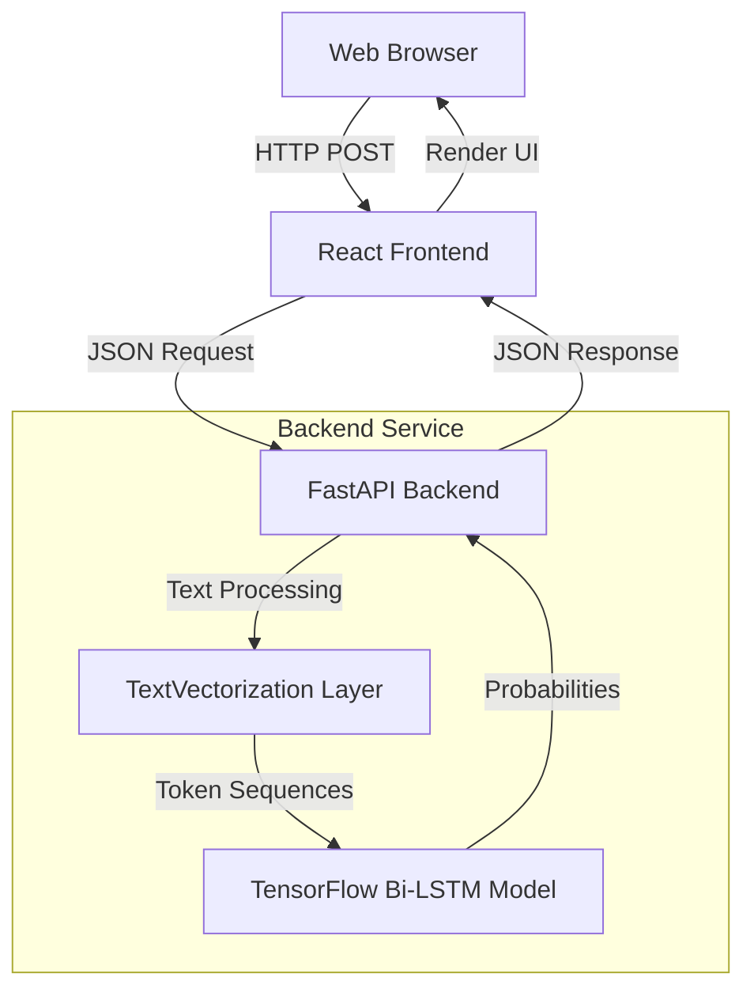

<div align="center">
  <div style="background-color: rgba(59, 130, 246, 0.1); padding: 12px; border-radius: 8px; display: inline-block; margin-bottom: 16px;">
    <svg xmlns="http://www.w3.org/2000/svg" width="48" height="48" viewBox="0 0 24 24" fill="none" stroke="#3b82f6" stroke-width="2" stroke-linecap="round" stroke-linejoin="round">
      <path d="M12 22s8-4 8-10V5l-8-3-8 3v7c0 6 8 10 8 10z"/>
    </svg>
  </div>
  
  <h1>ToxGuard AI</h1>
  <p><strong>Advanced deep learning classification for toxicity, insults, and threats in text.</strong></p>

  <p>
    
    
    
    
    
  </p>
</div>

## 📖 Project Overview

ToxGuard AI is a production-ready, full-stack application designed to automatically detect and classify toxic language in user-generated content. Built to solve the pervasive issue of online harassment and abusive behavior, the project uses a custom-trained Bidirectional LSTM deep learning model to evaluate text across six specific dimensions of toxicity. 

The system features a sleek, highly responsive frontend interface built with React and TailwindCSS, communicating with a robust, memory-optimized Python FastAPI backend. The entire application is containerized using Docker, allowing for seamless deployment to modern cloud platforms.

## ✨ Features

- 🧠 **Deep Learning Inference:** Accurately classifies text across 6 categories (Toxic, Severe Toxic, Obscene, Threat, Insult, Identity Hate).
- ⚡ **Real-Time Analysis:** Lightning-fast API responses powered by FastAPI and an optimized TensorFlow pipeline.
- 🎨 **Modern UI/UX:** Premium dark-mode interface with glassmorphism effects, built with TailwindCSS v4 and Framer Motion.
- 🐳 **Containerized Architecture:** Fully dockerized services with `docker-compose` for rapid local development and production deployment.
- 📉 **Memory Optimized:** TensorFlow threading and memory configuration tuned specifically for low-resource environments (e.g., Render free tier).
- 📜 **Scan History:** Locally persisted session history for easy review of recent scans.

## 🛠️ Tech Stack

| Category | Technologies |
| :--- | :--- |
| **Frontend** | React 19, TypeScript, Vite, TailwindCSS v4, Framer Motion, Lucide-React |
| **Backend** | FastAPI, Python 3.9, Uvicorn, Pydantic |
| **AI / Machine Learning** | TensorFlow 2.15 (CPU), Keras, Pandas, NumPy |
| **Deep Learning Architecture** | Bidirectional LSTM, Embedding layers, `TextVectorization` |
| **DevOps & Deployment** | Docker, Docker Compose, NGINX, Render |

## 🏗️ Architecture

The system follows a modern decoupled frontend/backend architecture, communicating via RESTful API over HTTP.



## 🧠 Machine Learning / Deep Learning Pipeline

The machine learning pipeline takes raw text strings and maps them through a robust sequence model to output classification probabilities.

1. **Dataset**: Trained on the **Jigsaw Toxic Comment Classification Challenge** dataset (`train.csv`).
2. **Preprocessing**: Handled dynamically using Keras `TextVectorization`. The model utilizes a vocabulary constraint mapped dynamically from an extracted `vocab.pkl`.
3. **Model Architecture**:
   - **Embedding Layer**: Maps vocabulary indices to dense 32-dimensional vectors.
   - **Bidirectional LSTM**: 32 units utilizing `tanh` activation to capture context from both directions.
   - **Fully Connected (Dense) Layers**: Three dense layers (128 → 256 → 128 units) with `relu` activation for feature extraction.
   - **Output Layer**: 6 units with `sigmoid` activation for multi-label binary classification.
4. **Training**: Compiled with Binary Crossentropy loss and the Adam optimizer. 
5. **Inference Adjustments**: The backend includes explicit profanity overrides and scaled thresholds to counter LSTM padding dilution on longer sequences.

### 📊 Model Details
- **Type**: Deep Sequence Model (NLP)
- **Framework**: TensorFlow / Keras
- **Input**: Raw text string
- **Output**: 6-dimensional float array (Probabilities: `0.0` to `1.0`)

## 📂 Project Structure

```text
project/
├── backend/                  # FastAPI Backend Service
│   ├── main.py               # Application entry point & API routes
│   ├── config.py             # Environment & configuration settings
│   ├── requirements.txt      # Python dependencies
│   ├── Dockerfile            # Backend container definition
│   ├── model/                # ML Assets
│   │   ├── model_service.py  # TF model loader & inference engine
│   │   ├── toxicity.h5       # Pre-trained model weights
│   │   └── vocab.pkl         # Serialized vocabulary map
│   ├── scripts/              # Utilities
│   │   └── extract_vocab.py  # Vocab extraction script
│   └── utils/                
│       └── schemas.py        # Pydantic request/response models
├── frontend/                 # React Frontend Service
│   ├── src/                  
│   │   ├── App.tsx           # Main React component & UI
│   │   ├── api.ts            # Axios API client
│   │   ├── index.css         # Tailwind directives
│   │   └── main.tsx          # React DOM entry
│   ├── package.json          # Node dependencies
│   ├── vite.config.ts        # Vite configuration
│   └── Dockerfile            # NGINX frontend container definition
└── docker-compose.yml        # Multi-container orchestration
```

## 🚀 Quick Start & Installation

### 1. Local Development (Without Docker)

**Backend Setup:**
```bash
cd project/backend
python3 -m venv venv
source venv/bin/activate
pip install -r requirements.txt
uvicorn main:app --reload --port 8000
```

**Frontend Setup:**
```bash
cd project/frontend
npm install
npm run dev
```
The application will be accessible at `http://localhost:5173`.

### 2. Docker Deployment (Recommended)

To run the entire stack locally using Docker:

```bash
cd project
docker compose up --build -d
```
- **Frontend**: Access via `http://localhost:3000`
- **Backend API**: Access via `http://localhost:8000`

## 🐳 Docker Configuration

The project utilizes multi-stage Docker builds to ensure lean production images:
- **Backend Container**: Uses `python:3.9-slim`. Injects specific environment variables (`MALLOC_ARENA_MAX`, `TF_NUM_INTEROP_THREADS`) to limit TensorFlow memory footprint.
- **Frontend Container**: Uses `node:22-alpine` for the build stage and `nginx:alpine` to serve the static SPA assets.

## 🌐 Production Deployment

The application is configured for seamless deployment to **Render**. Both the backend and frontend can be deployed directly from your GitHub repository.

### Deploying the Backend (Render Web Service)
1. In your Render Dashboard, click **New +** and select **Web Service**.
2. Connect your GitHub repository.
3. Set the following configurations:
   - **Environment:** `Docker`
   - **Build Command:** *(Leave default, Render uses the Dockerfile)*
   - **Start Command:** `uvicorn main:app --host 0.0.0.0 --port $PORT`
   - **Instance Type:** Minimum 512MB RAM (Free tier is sufficient but might take slightly longer to boot).
4. Click **Create Web Service**.

### Deploying the Frontend (Render Static Site)
1. In your Render Dashboard, click **New +** and select **Static Site**.
2. Connect the same GitHub repository.
3. Set the following configurations:
   - **Root Directory:** `project/frontend` (or just `frontend` depending on your repo structure)
   - **Build Command:** `npm install && npm run build`
   - **Publish Directory:** `dist`
4. Add the following Environment Variable:
   - `VITE_API_URL`: Set this to your newly deployed backend URL (e.g., `https://toxguard-backend.onrender.com`).
5. Add a Rewrite Rule (for React Router/SPA support):
   - **Source:** `/*`
   - **Destination:** `/index.html`
   - **Action:** `Rewrite`
6. Click **Create Static Site**.

## 📡 API Documentation

### `POST /api/v1/predict`
Analyzes a text string and returns toxicity probabilities.

**Request Body:**
```json
{
  "text": "The comment text to analyze"
}
```

**Response:**
```json
{
  "text": "The comment text to analyze",
  "predictions": {
    "toxic": { "probability": 0.12, "flag": false },
    "severe_toxic": { "probability": 0.01, "flag": false },
    "obscene": { "probability": 0.05, "flag": false },
    "threat": { "probability": 0.00, "flag": false },
    "insult": { "probability": 0.08, "flag": false },
    "identity_hate": { "probability": 0.02, "flag": false }
  },
  "is_toxic": false
}
```

### `GET /status`
Health check endpoint used for load balancer pinging.

**Response:**
```json
{
  "status": "healthy",
  "model_loaded": true,
  "version": "1.0.0"
}
```

## 📸 Screenshots


*Analyze text with real-time probability breakdown.*


*Review historical comment scans using the persistent history log.*

## 🔮 Future Improvements

- **Transformer Migration**: Upgrade the Bi-LSTM model to a lightweight Transformer (e.g., DistilBERT) for better contextual understanding.
- **Multilingual Support**: Expand the dataset and tokenizer to support multiple languages.
- **Explainable AI (XAI)**: Highlight the exact words or phrases in the UI that triggered the toxicity flags.
- **Rate Limiting**: Implement API rate limiting in FastAPI using `slowapi` to prevent abuse in production.

## 🤝 Contributing

Contributions are always welcome! Please follow these steps:
1. Fork the project.
2. Create your feature branch (`git checkout -b feature/AmazingFeature`).
3. Commit your changes (`git commit -m 'Add some AmazingFeature'`).
4. Push to the branch (`git push origin feature/AmazingFeature`).
5. Open a Pull Request.

## 📄 License

Distributed under the MIT License. See `LICENSE` for more information.

## ✍️ Author

**Aaditya**
- Software Engineer & ML Practitioner
- Passionate about building robust AI-driven applications and solving real-world problems.
